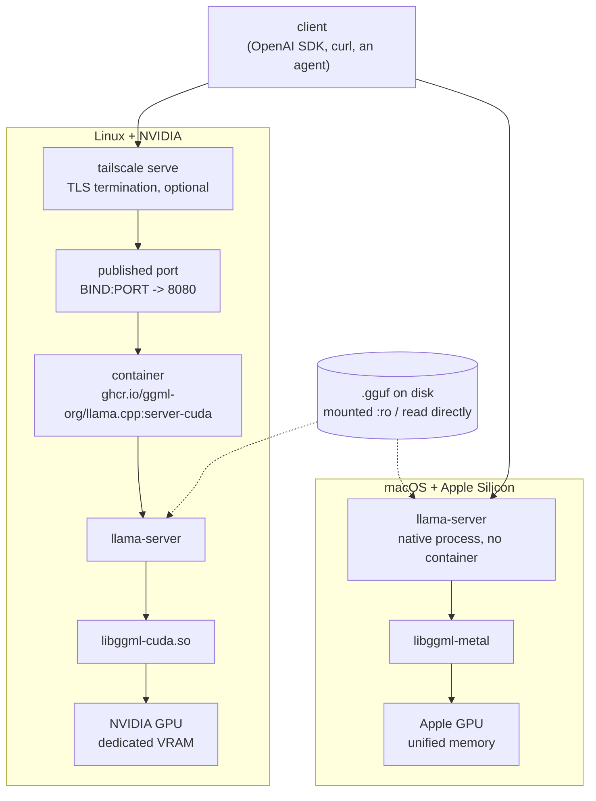

# Architecture

How the whole thing actually works, from an HTTP request to the arithmetic happening on
the GPU. `README.md` tells you which flags to set; this file tells you what they are
setting, and why the pieces are arranged the way they are.

Read this before changing anything structural. For the measurements behind the numbers
quoted here, see `EXPERIMENTS.md`.

---

## 1. The shape of it

There are **two runtimes**, and they diverge below the HTTP layer. Everything above it —
the API, the flags, the `.env`, the documentation — is shared.



The single most important structural fact: **the container is not what makes this work on
Linux, and its absence is not what makes macOS different.** The container is packaging.
What matters is which `libggml-*` backend `llama-server` was built against, and whether it
can reach a GPU. On Linux that requires `nvidia-container-toolkit` to pass the devices
through; on macOS it is impossible from inside Docker, because Docker Desktop's Linux VM
has no path to the Apple GPU at all.

---

## 2. Layer by layer

### The image

`ghcr.io/ggml-org/llama.cpp:server-cuda`, 4.3 GB, official (`ggml-org` is the project's
own organisation).

```
ENTRYPOINT  /app/llama-server
Cmd         null
```

Two consequences that explain the shape of `docker-compose.yml`:

- **The entrypoint is already the server binary**, so everything in the compose `command:`
  block is a `llama-server` flag, not a Docker one. This is why `-m`, `-c` and `-ngl`
  appear there and look out of place.
- **The image ships no model.** The 4.3 GB is `libggml-cuda.so` plus one `libggml-cpu-*.so`
  per microarchitecture, selected at runtime. The `.gguf` arrives through the volume, so
  the same image serves any model.

### The volume

```yaml
volumes:
  - ${MODELS_DIR}:/models:ro
```

`:ro` is not decoration. The `.gguf` files take hours to fetch, and a read-only mount is
the one mechanism that makes it structurally impossible for anything inside the container
to damage them — no bug, no mistyped path, no agent.

### The port

```yaml
ports:
  - "${BIND:-127.0.0.1}:${PORT:-8080}:8080"
```

Inside the container `llama-server` binds `0.0.0.0:8080`, which is safe because the
container's network namespace is not the host's. `BIND` decides what the host exposes:

| `BIND` | Reachable from |
|---|---|
| `127.0.0.1` | this machine only — the default |
| tailscale IP | every device on the tailnet, no TLS |
| `0.0.0.0` | the local network, and whatever the router forwards |

**There is no authentication anywhere in this stack.** `BIND` is the entire access control
story, which is why it defaults to loopback and why changing it is treated as a security
decision rather than a configuration one.

### TLS, optionally

`tailscale serve --bg 8080` terminates TLS with a real tailnet certificate and proxies to
`127.0.0.1:8080`. It adds encryption and a hostname; it adds **no authentication**.

Note the coupling: `tailscale serve` proxies to loopback, so it only works while `BIND`
stays `127.0.0.1`. Setting `BIND` to the tailscale IP makes `serve` redundant, and leaving
both configured gives two paths to one port, one of which 502s.

### The healthcheck

```yaml
start_period: 300s
```

`docker compose up -d` succeeding means the container started, not that the model loaded.
Loading 18 GB from disk into VRAM takes minutes, and llama.cpp can still fail during it.
The generous `start_period` exists for that; `/health` answering is the real readiness
signal, which is what `serve.sh up` waits on.

---

## 3. The macOS runtime, side by side

| | Linux + NVIDIA | macOS + Apple Silicon |
|---|---|---|
| Packaging | container | native binary (`brew install llama.cpp`) |
| Backend | `libggml-cuda.so` | `libggml-metal` |
| GPU offload flag | `-ngl all` | `-ngl all` — same flag, different backend |
| Memory | dedicated VRAM, separate budget | unified, shared with the OS |
| Process management | `docker compose` | pid file, `scripts/serve-metal.sh` |
| Driver dependency | NVIDIA driver + `nvidia-container-toolkit` | none — Metal is part of the OS |
| Started by | `scripts/serve.sh` | `scripts/serve-metal.sh` |
| Memory reporting | `nvidia-smi` (`serve.sh vram`) | `sysctl` (`serve-metal.sh mem`) |

Everything else is identical, because everything else is `llama-server`: the same flags,
the same `.env`, the same `/metrics` counters, the same `print_timing` log lines. That is
what makes the tuning in `EXPERIMENTS.md` portable even though the infrastructure is not.

Details and the open questions in `docs/macos.md`.

---

## 4. Where the memory goes

Four consumers. Knowing which pool each comes from is the difference between a config that
loads and one that OOMs on the first long prompt.

| Consumer | Pool on Linux | Pool on macOS | Size, reference setup |
|---|---|---|---|
| Model weights | VRAM | unified | 17,092 MiB |
| KV cache | VRAM | unified | 2,312 MiB at `CTX=65536`, `q8_0` |
| Compute buffers, CUDA context, SSM state | VRAM | unified | ~1,670 MiB |
| Prompt cache (`--cache-ram`) | **host RAM** | unified | 10,240 MiB configured |

The measured total on the reference RTX 3090 is **21,074 MiB of 24,576**, which the first
three rows account for.

**`--cache-ram` is the one that surprises people.** On Linux it is host RAM — a completely
separate budget, invisible to `nvidia-smi`, and the reason `CACHE_RAM=10240` costs nothing
in VRAM. On macOS's unified memory there is no separate budget, so the same value is 10 GB
taken from what is left after the weights load. The correct value differs by platform.

### KV cache arithmetic

```
bytes/token = (key_length + value_length) x head_count_kv x bytes_per_element x n_layers_with_kv
```

Every term comes from the model's own metadata; `scripts/gguf-info.py` reads them and does
the multiplication. `bytes_per_element` is 2.0 for `f16`, 1.0625 for `q8_0` (32 values in
34 bytes: 32 int8 plus one f16 scale), 0.5625 for `q4_0`.

**`n_layers_with_kv` is the term that gets assumed rather than checked**, and on a hybrid
model the assumption is wrong by a large factor. See §5.

The whole cache is allocated **when the model loads**, sized for `CTX`, not grown as the
conversation does. Raising `CTX` bills the memory immediately whether the window is used
or not.

---

## 5. The model, and why its architecture matters here

Not every model is like the reference one, but the *method* of checking generalises, and
skipping the check is how the VRAM arithmetic goes wrong.

`scripts/gguf-info.py` on Qwen3.8-27B reports:

```
qwen35.block_count             65
qwen35.full_attention_interval 4
qwen35.attention.head_count    24
qwen35.attention.head_count_kv 4
qwen35.attention.key_length    256
qwen35.attention.value_length  256
qwen35.ssm.state_size          128
qwen35.ssm.inner_size          6144
qwen35.nextn_predict_layers    1
qwen35.context_length          262144
```

### It is a hybrid, not a dense transformer

Confirmed against the tensor index, not just the metadata:

| Blocks | Count | Which | Carries KV? |
|---|---|---|---|
| Full attention | 16 | 3, 7, 11 … 63 — every fourth | yes |
| Linear attention / SSM | 48 | all the others | **no** |
| MTP head | 1 | 64 | yes |

The 48 SSM blocks hold a **recurrent state of fixed size** — it does not grow with the
context at all. So 17 of 65 blocks pay for context length, not 65.

Consequences that matter operationally:

- KV costs **36.1 KiB/token** at `q8_0`, not the ~138 KiB a dense estimate gives.
- `CTX=65536` therefore costs 2,312 MiB, and a 24 GB card tops out near **131,072 tokens**
  rather than the ~40k a dense estimate predicts.
- Getting this backwards in the other direction — assuming hybrid on a dense model — would
  *underestimate* the cache and OOM on load. **Run the tool; do not pattern-match.**

### The MTP heads are why speculation is free

`blk.64.nextn.*` are weights trained to predict several tokens ahead. They ship inside the
`.gguf` whether or not they are used — with any drafter other than `draft-mtp`, the server
loads and ignores them, and says so:

```
W model has unused tensor blk.64.nextn.eh_proj.weight -- ignoring
```

`--spec-type draft-mtp` drafts with them instead. No second model, no download, no extra
weights in memory. Measured: **+31% decode** over `ngram-simple`, and **lossless** — see §6.

---

## 6. What happens during a request

### Prefill, then decode

Two phases with completely different performance characteristics, which is why
`print_timing` reports them separately:

| | Bound by | Reference throughput |
|---|---|---|
| **Prefill** — process the prompt | compute; the whole prompt goes through in batches of `-b`/`-ub` | ~900–1,120 t/s |
| **Decode** — generate the answer | memory bandwidth; every token reads all the weights | 45–82 t/s |

That decode is bandwidth-bound and not compute-bound is the single fact that predicts
performance on new hardware. It is why an Apple Silicon estimate can be made from a
bandwidth ratio, and why `-np 1` — one conversation at a time — leaves the GPU's compute
mostly idle.

### The prompt cache

An agent resends a long, mostly-unchanged conversation every turn. Reprocessing it each
time is the worst latency in the system: **35 seconds to first token** on a 48k context.

llama.cpp keeps previous contexts in host RAM (`--cache-ram`) and, on a new request, picks
the slot with the longest common prefix — visible in the log as
`selected slot by LCP similarity, f_sim_best`. Only the divergent tail is prefilled.

Measured under real agent load: **71.2% of prompt tokens served from cache**. When the
cache is too small it evicts (`making room for prompt cache entry`) and the next turn pays
the full 35 seconds. `EXPERIMENTS.md` §3.

### The speculative decoding loop

Per step, with `--spec-draft-n-max 8 --spec-draft-p-min 0.7`:

1. The MTP head drafts up to 8 tokens, stopping early if confidence drops below `p-min`.
2. The full model verifies the whole draft **in one forward pass** — the same pass that
   would have produced a single token.
3. Tokens matching what the model would have generated are kept; from the first mismatch
   on, the rest are discarded.

**The output is identical to what the model would have produced unaided.** Rejected drafts
cost time, never correctness. This is the only knob in the config with no quality
trade-off — unlike `KV_TYPE` or the sampling values.

Measured: 78% acceptance, **3.17 tokens emitted per forward pass**. And why it pays off
disproportionately: a forward pass reads all 17.9 GB of weights whether it verifies one
token or eight, so on a bandwidth-bound workload the extra tokens are close to free.

Watch it with:

```bash
./scripts/serve.sh logs 200 | grep 'draft acceptance'
```

If acceptance is low the drafter is costing more than it saves, and `SPEC_TYPE=none` beats
a bad drafter.

---

## 7. How a setting reaches the GPU

One chain, no exceptions:

```
.env                    CTX=65536
  |
docker-compose.yml      -c ${CTX:-65536}
  |
llama-server            allocates the KV cache for 65536 tokens
  |
libggml-cuda            the allocation lands in VRAM
```

Design rules that follow from it, and that keep the repo maintainable:

- **`.env` is per-machine and gitignored.** `.env.example` is the versioned reference. A
  new variable that is not mirrored into the example cannot be reproduced by anyone else.
- **Every value in `docker-compose.yml` is `${VAR:-default}`.** Changing models or tuning
  should never mean editing the compose file. If you find yourself editing it, either the
  variable is missing or you are adding a flag — and a new flag needs a `.env.example`
  entry and a line in README §4.
- **`scripts/serve-metal.sh` reads the same `.env`** and transcribes the same `command:`
  block. Any flag change must be made in both, or the two runtimes drift apart silently.

---

## 8. Deliberate omissions

Things that look missing and are not:

- **No authentication.** Out of scope; `BIND` on loopback is the control. Anything that
  widens exposure is an explicit decision, never a default.
- **`restart: "no"`.** The model holds nearly the whole card. Auto-starting on boot would
  claim the GPU on days it is needed for training. Bringing it up is a manual act.
- **`-np 1`, one slot.** The full KV cache goes to a single conversation. More slots divide
  it, which changes every number in §4. Concurrency has never been measured here —
  `requests_deferred` has stayed at 0.
- **No model in the image.** Models are tens of GB and change independently of the server.
- **No CUDA toolkit on the host.** It ships inside the image; installing `nvcc` to "fix" a
  problem is almost always the wrong move.
- **No Python dependencies.** `download-model.sh` uses `curl`, `gguf-info.py` uses only the
  standard library. On a shared machine, installing nothing is the better trade.
